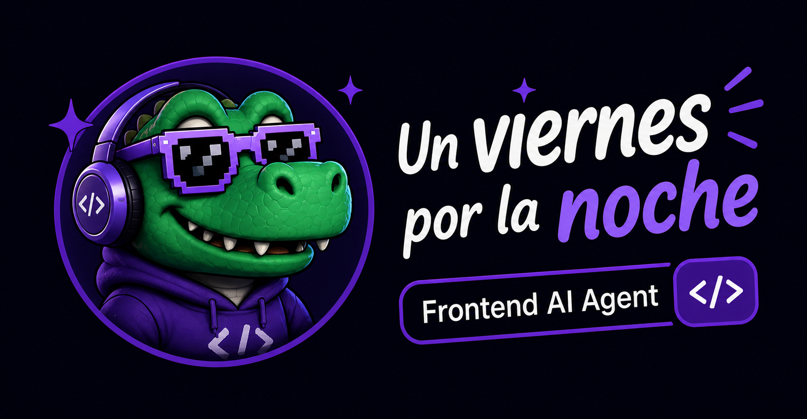

<p align="center">
  
</p>

<p align="center">
  
  
  
</p>

<p align="center">
  
  
  
  
  
  
</p>

<br/>

<p align="center">
  <strong>El ecosistema de agentes de IA especializado en frontend y UI.</strong><br/>
  UI bonita. Codigo limpio. Deploy y a dormir.
</p>

---

## Que es uvpln?

`uvpln` es un equipo de **8 agentes especializados** para [Claude Code](https://claude.ai/code) enfocados exclusivamente en frontend. No es un agente generico que hace de todo — es un especialista que conoce profundo el stack moderno y habla como la gente.

<p align="center">
  
</p>

> *UI bonita. Codigo limpio. Deploy y a dormir.*

---

## Los agentes

<table>
  <thead>
    <tr>
      <th>Agente</th>
      <th>Especialidad</th>
    </tr>
  </thead>
  <tbody>
    <tr>
      <td></td>
      <td>Arquitectura de componentes, React 19, Next.js 15, Tailwind 4, shadcn/ui</td>
    </tr>
    <tr>
      <td></td>
      <td>Testing exhaustivo con browser real, responsive, estados, edge cases</td>
    </tr>
    <tr>
      <td></td>
      <td>Accesibilidad WCAG 2.2, ARIA, gestion de foco, semantica</td>
    </tr>
    <tr>
      <td></td>
      <td>Animaciones, Framer Motion, transiciones, micro-interacciones</td>
    </tr>
    <tr>
      <td></td>
      <td>Design tokens, variables CSS, dark mode, theming</td>
    </tr>
    <tr>
      <td></td>
      <td>Core Web Vitals, bundle size, lazy loading, optimizacion visual</td>
    </tr>
    <tr>
      <td></td>
      <td>Revision de TypeScript/React — seguridad, calidad, patrones</td>
    </tr>
    <tr>
      <td></td>
      <td>Refactor de componentes sin cambiar comportamiento</td>
    </tr>
  </tbody>
</table>

---

## El loop de calidad

El diferenciador de uvpln. Ningun componente es **listo** hasta que pasa el loop completo:

```
╔══════════════════════════════════════════════╗
║                                              ║
║   ui-architect  →  diseña el componente      ║
║         ↓                                    ║
║   ui-tester     →  lo rompe con browser real ║
║         ↓                                    ║
║   ui-architect  →  corrige con el reporte    ║
║         ↓                                    ║
║   ui-tester     →  APROBADO ✓                ║
║                                              ║
╚══════════════════════════════════════════════╝
```

---

## Experiencia al abrir Claude Code

uvpln personaliza Claude Code con una pantalla de bienvenida y una statusline en tiempo real.

**Banner al iniciar:**
```
  ██╗   ██╗██╗   ██╗██████╗ ██╗     ███╗   ██╗
  ██║   ██║██║   ██║██╔══██╗██║     ████╗  ██║
  ...

  Un Viernes Por La Noche — Frontend AI Agent
  UI bonita. Codigo limpio. Deploy y a dormir.

  Proyecto:      mi-proyecto
  Design system: cargado (48 lineas)
  Agentes:       8 disponibles

  Hola parcero, que haremos hoy?
```

**Statusline en tiempo real** (barra inferior):
```
🐊 uvpln · mi-proyecto │ 8 agentes │ ◉ design system │ sonnet-4.6 · 12% ctx · $0.023 │ Cartagena 🇨🇴
```

---

## Hooks de calidad

uvpln vigila el codigo mientras escribis:

| Hook | Que hace |
|------|----------|
| `PreToolUse` | Bloquea si detecta colores hardcodeados (`text-[#fff]`) — usa tokens |
| `PostToolUse` | Avisa si hay usos de `any` en TypeScript |

---

## Instalacion

### Windows

```powershell
git clone https://github.com/jcarlosabc/un-viernes-por-la-noche.git
cd un-viernes-por-la-noche
powershell -ExecutionPolicy Bypass -File install.ps1
```

Despues escribi `uvpln` en cualquier terminal para abrir Claude Code con identidad uvpln.

### Linux / macOS / WSL

```bash
git clone https://github.com/jcarlosabc/un-viernes-por-la-noche.git
cd un-viernes-por-la-noche
bash install.sh
```

Los agentes quedan en `~/.claude/agents/` listos para usar con Claude Code.

### Requisitos

<p>
  
  
  
</p>

Solo necesitas una suscripcion de Claude. Sin Docker, sin dependencias, sin infraestructura.

---

## Estructura del proyecto

```
un-viernes-por-la-noche/
├── install.sh                  → instalador Linux/macOS/WSL
├── install.ps1                 → instalador Windows
├── uvpln.cmd                   → comando uvpln para Windows
├── claude/
│   ├── CLAUDE.md               → personalidad y reglas globales
│   ├── settings.json           → hooks cross-platform (Windows + Linux)
│   ├── session-start.js        → banner de bienvenida (Node.js)
│   ├── session-end.js          → cierre de sesion (Node.js)
│   ├── statusline.cjs          → barra inferior en tiempo real
│   └── agents/
│       ├── ui-architect.md
│       ├── ui-tester.md
│       ├── a11y-expert.md
│       ├── motion-designer.md
│       ├── tokens-manager.md
│       ├── performance-ui.md
│       ├── code-reviewer.md
│       └── refactoring-specialist.md
```

---

## Por que uvpln y no otros

| | Helix | Engram | **uvpln** |
|--|:-----:|:------:|:---------:|
| Especializacion frontend | ✗ | ✗ | ✅ |
| Loop diseno → testing | ✗ | ✗ | ✅ |
| React 19 / Next.js 15 | ✗ | ✗ | ✅ |
| Sin dependencias extra | ✗ | Parcial | ✅ |
| Memoria de design system | ✗ | Parcial | ✅ |
| Statusline personalizada | ✗ | ✗ | ✅ |
| Soporte Windows nativo | ✗ | ✗ | ✅ |
| Personalidad propia | ✗ | ✗ | ✅ |

---

## Stack de referencia

<p>
  
  
  
  
</p>
<p>
  
  
  
  
</p>

---

<p align="center">
  Hecho con berraquera desde Cartagena de Indias, Colombia 🇨🇴
</p>
