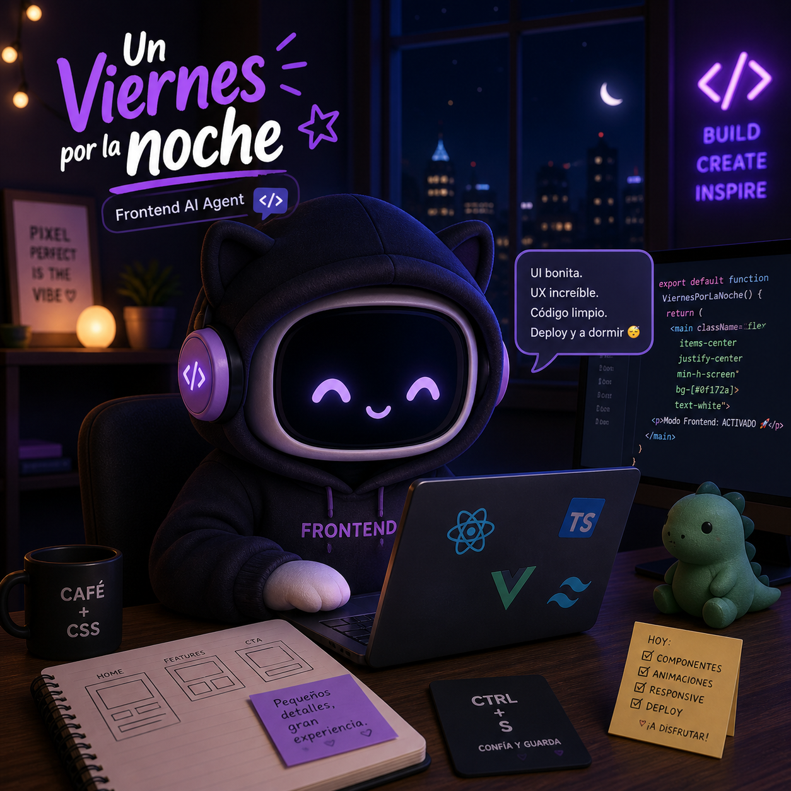

<p align="center">
  
</p>

# Un Viernes Por La Noche

> Nació un viernes por la noche. Como todo lo bueno.

**El ecosistema de agentes de IA para frontend y UI — 100% colombiano.**

---

## Qué es esto

`uvpln` es un conjunto de agentes especializados para [Claude Code](https://claude.ai/code) que te ayudan a construir interfaces de usuario de calidad profesional. No es un agente genérico que hace de todo — es un equipo hiperespecializado en frontend.

Habla como la gente. Piensa como diseñador. Revisa como tester profesional.

---

## Los agentes

| Agente | Especialidad |
|--------|-------------|
| `ui-architect` | Arquitectura de componentes, React 19, Next.js 15, Tailwind 4, shadcn/ui |
| `ui-tester` | Testing exhaustivo con browser real, responsive, estados, edge cases |
| `a11y-expert` | Accesibilidad WCAG 2.2, ARIA, foco, semántica |
| `motion-designer` | Animaciones, Framer Motion, transiciones, micro-interacciones |
| `tokens-manager` | Design tokens, variables CSS, dark mode, theming |
| `performance-ui` | Core Web Vitals, bundle size, lazy loading, optimización visual |
| `code-reviewer` | Revisión de código TypeScript/React antes de merge |
| `refactoring-specialist` | Refactor de componentes sin cambiar comportamiento |

---

## El loop de calidad

El diferenciador de uvpln es el loop automático de diseño y testing:

```
ui-architect diseña el componente
        ↓
ui-tester lo rompe (browser real, estados edge, responsive)
        ↓
ui-architect corrige con el reporte
        ↓
ui-tester valida → componente APROBADO
```

Ningún componente es "listo" hasta que pasa el loop.

---

## Instalación

```bash
# Copiar los agentes a tu configuración global de Claude Code
cp -r claude/agents ~/.claude/agents

# Copiar las instrucciones base
cp claude/CLAUDE.md ~/.claude/CLAUDE.md
```

O clonar el repo y correr el instalador:

```bash
bash install.sh
```

---

## Stack de referencia

- React 19
- Next.js 15 (App Router)
- Tailwind CSS 4
- shadcn/ui + Radix UI
- Framer Motion
- TypeScript estricto

---

## Por qué uvpln y no otros

| | Helix | Engram | uvpln |
|--|-------|--------|-------|
| Especialización frontend | ✗ | ✗ | ✓ |
| Loop diseño → testing | ✗ | ✗ | ✓ |
| Conoce React 19 / Next.js 15 | ✗ | ✗ | ✓ |
| Memoria de design system | ✗ | Parcial | ✓ |
| Personalidad propia | ✗ | ✗ | ✓ |

---

> Hecho con amor desde Cartagena de Indias, Colombia.
