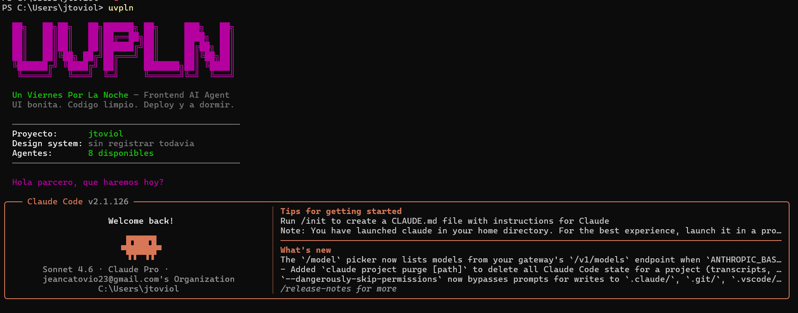

<p align="center">
  
</p>

<p align="center">
  
  
  
</p>

<p align="center">
  
  
  
  
  
  
</p>

<br/>

<p align="center">
  <strong>El ecosistema de agentes de IA especializado en frontend y UI.</strong><br/>
  UI bonita. Codigo limpio. Deploy y a dormir.
</p>

---

## Instalacion

<p>
  
  
  
  
</p>

```bash
npm install -g uvpln
uvpln install
```

Eso es todo. **`uvpln install` no toca tu Claude Code vanilla** — copia todo a `~/.claude-uvpln/` y queda aislado. Despues:

```bash
claude    # Claude Code vanilla (sin uvpln)
uvpln     # Claude Code con uvpln (23 agentes, 17 hooks, statusline visual)
```

Los dos comandos coexisten. Podes alternar cuando quieras.

### Actualizar

```bash
npm install -g uvpln@latest
uvpln install
```

El primer comando actualiza el paquete npm. El segundo aplica los nuevos agentes, hooks y configuracion a `~/.claude-uvpln/`.

### Comandos del CLI

```bash
uvpln                       # Lanza Claude Code con uvpln
uvpln install               # Instala uvpln en ~/.claude-uvpln/
uvpln uninstall             # Desinstala uvpln (no toca vanilla, preserva memoria)
uvpln uninstall --full      # Borra TODO + remueve el paquete npm automaticamente
uvpln status                # Ver que esta instalado
uvpln --version             # Version del CLI
uvpln --help                # Ayuda completa
uvpln chat hola             # Passthrough — equivalente a "claude chat hola"
```

### Requisitos

- **Claude Code** y suscripcion **Claude Pro o Max**
- **Node.js 18+** — el CLI, la statusline y los hooks corren en Node (cross-platform)

Sin Docker, sin Python, sin infraestructura.

Asi se ve uvpln corriendo en PowerShell:

<p align="center">
  
</p>

### Instalacion alternativa (sin npm)

```bash
git clone https://github.com/jcarlosabc/un-viernes-por-la-noche.git
cd un-viernes-por-la-noche
bash install.sh                                          # Linux / macOS / WSL
# o
powershell -ExecutionPolicy Bypass -File install.ps1     # Windows
```

---

## Que es uvpln?

`uvpln` es un equipo de **23 agentes especializados** para [Claude Code](https://claude.ai/code) enfocados exclusivamente en frontend moderno. No es un agente generico que hace de todo — es un equipo entero que cubre el stack completo: desde traducir una referencia visual a codigo world-class hasta integrar Stripe, mandar mailings transaccionales con React Email, configurar SEO + OG images dinamicas, soportar multi-idioma con RTL, tracking de analytics GDPR-compliant, AI features con streaming, Storybook con visual regression, y validar todo (accesibilidad, performance, seguridad) antes del merge. Y aprende: cada bug que el `ui-tester` detecta se guarda como lesson para que no se repita.

<p align="center">
  
</p>

> *UI bonita. Codigo limpio. Deploy y a dormir.*

---

## Los agentes

<details open>
<summary><strong>Ver los 23 agentes</strong></summary>

<br/>

<table>
  <thead>
    <tr>
      <th>Icono</th>
      <th>Agente</th>
      <th>Especialidad</th>
      <th>Modelo</th>
    </tr>
  </thead>
  <tbody>
    <tr>
      <td align="center">🔍</td>
      <td></td>
      <td>Traduce requerimientos vagos a flujos, estados y criterios de aceptacion</td>
      <td>Haiku</td>
    </tr>
    <tr>
      <td align="center">🌉</td>
      <td></td>
      <td>Convierte URLs, screenshots y referencias visuales en briefs para ui-architect</td>
      <td>Sonnet</td>
    </tr>
    <tr>
      <td align="center">🎨</td>
      <td></td>
      <td>Crea specs visuales: layout, jerarquia, tipografia, componentes shadcn a usar</td>
      <td>Haiku</td>
    </tr>
    <tr>
      <td align="center">🏗️</td>
      <td></td>
      <td>Arquitectura de componentes, React 19, Next.js 15, Tailwind 4, shadcn/ui</td>
      <td>Sonnet</td>
    </tr>
    <tr>
      <td align="center">🧪</td>
      <td></td>
      <td>Testing exhaustivo con browser real, responsive, estados, edge cases</td>
      <td>Sonnet</td>
    </tr>
    <tr>
      <td align="center">🐛</td>
      <td></td>
      <td>Analiza root cause de bugs — entrega diagnostico preciso a ui-architect</td>
      <td>Haiku</td>
    </tr>
    <tr>
      <td align="center">♿</td>
      <td></td>
      <td>Accesibilidad WCAG 2.2, ARIA, gestion de foco, semantica</td>
      <td>Haiku</td>
    </tr>
    <tr>
      <td align="center">✨</td>
      <td></td>
      <td>Animaciones, Framer Motion, transiciones, micro-interacciones</td>
      <td>Haiku</td>
    </tr>
    <tr>
      <td align="center">🪙</td>
      <td></td>
      <td>Design tokens, variables CSS, dark mode, theming</td>
      <td>Haiku</td>
    </tr>
    <tr>
      <td align="center">⚡</td>
      <td></td>
      <td>Core Web Vitals, bundle size, lazy loading, optimizacion visual</td>
      <td>Sonnet</td>
    </tr>
    <tr>
      <td align="center">👁️</td>
      <td></td>
      <td>Revision de TypeScript/React — seguridad, calidad, patrones</td>
      <td>Opus</td>
    </tr>
    <tr>
      <td align="center">🔧</td>
      <td></td>
      <td>Refactor de componentes sin cambiar comportamiento</td>
      <td>Sonnet</td>
    </tr>
    <tr>
      <td align="center">🔌</td>
      <td></td>
      <td>TanStack Query, SWR, fetch nativo — loading/error/empty states, paginacion, optimistic UI</td>
      <td>Sonnet</td>
    </tr>
    <tr>
      <td align="center">📝</td>
      <td></td>
      <td>Forms complejos: multi-step, file upload, campos dinamicos, validacion async</td>
      <td>Sonnet</td>
    </tr>
    <tr>
      <td align="center">🧠</td>
      <td></td>
      <td>Arquitectura de estado: useState vs useReducer vs Context vs Zustand — sin prop drilling</td>
      <td>Haiku</td>
    </tr>
    <tr>
      <td align="center">🔒</td>
      <td></td>
      <td>Seguridad cliente: XSS, secrets, auth patterns, CSP, headers, dependencias vulnerables, iframes</td>
      <td>Sonnet</td>
    </tr>
    <tr>
      <td align="center">📧</td>
      <td></td>
      <td>Mailings transaccionales y marketing — React Email, Resend, dark mode email, deliverability</td>
      <td>Sonnet</td>
    </tr>
    <tr>
      <td align="center">📈</td>
      <td></td>
      <td>Metadata API, OG images dinamicas con @vercel/og, sitemap, robots, JSON-LD, hreflang</td>
      <td>Sonnet</td>
    </tr>
    <tr>
      <td align="center">🌍</td>
      <td></td>
      <td>next-intl, ICU MessageFormat, plurales, RTL, formato por locale, gestion con Crowdin/Lokalise</td>
      <td>Sonnet</td>
    </tr>
    <tr>
      <td align="center">📊</td>
      <td></td>
      <td>PostHog, Plausible, GA4 — taxonomia de eventos, Web Vitals reales, A/B testing, GDPR cookie banner</td>
      <td>Sonnet</td>
    </tr>
    <tr>
      <td align="center">💳</td>
      <td></td>
      <td>Stripe Checkout/Subscriptions/Customer Portal, Lemon Squeezy, webhooks idempotentes, paywalls, tax</td>
      <td>Sonnet</td>
    </tr>
    <tr>
      <td align="center">🤖</td>
      <td></td>
      <td>Vercel AI SDK, streaming UIs, tool calling, generative UI, RAG con embeddings, prompt injection prevention</td>
      <td>Sonnet</td>
    </tr>
    <tr>
      <td align="center">📖</td>
      <td></td>
      <td>Storybook 9, CSF3, interaction tests, visual regression con Chromatic, MDX docs, addon-a11y</td>
      <td>Sonnet</td>
    </tr>
  </tbody>
</table>

> Los mismos iconos aparecen en la statusline (linea 2) — ves de un vistazo que agente esta corriendo. El activo se resalta en morado brillante.

</details>

---

## El loop de calidad

El diferenciador de uvpln. Ningun componente es **listo** hasta que pasa el loop completo — y el loop corre solo:

```
╔══════════════════════════════════════════════════════════════╗
║                                                              ║
║   ux-researcher   →  filtra req vago en flujos y estados     ║
║         ↓            (solo si el requerimiento es vago)      ║
║   design-bridge   →  traduce referencia visual a brief       ║
║   ui-designer     →  crea spec visual si no hay referencia   ║
║         ↓                                                    ║
║   ui-architect    →  construye el componente                 ║
║         ↓                                                    ║
║   ui-tester       →  lo rompe con browser real               ║
║         ↓                                                    ║
║   debugger        →  analiza root cause (si bug no obvio)    ║
║         ↓                                                    ║
║   ui-architect    →  corrige con diagnostico preciso         ║
║         ↓                                                    ║
║   ui-tester       →  APROBADO ✓                              ║
║         ↓                                                    ║
║   code-reviewer   →  valida antes de merge                   ║
║                                                              ║
╚══════════════════════════════════════════════════════════════╝
```

Cuando `ui-architect` termina un componente, un hook `PostToolUse` le avisa a Claude automaticamente que debe invocar `ui-tester`. El loop cierra solo — no necesitas recordarlo.

Para ejecutar el loop completo desde cero:

```
/uvpln-loop descripcion del componente que necesitas
```

### Slash commands disponibles

| Comando | Que hace |
|---------|----------|
| `/uvpln-loop` | Loop completo: architect → tester → fix → aprobado |
| `/uvpln-audit` | Auditoria de a11y + tokens hardcodeados + performance — reporte consolidado |
| `/uvpln-security-audit` | 🔒 Auditoria completa de seguridad cliente — XSS, secrets, auth, CSP, headers, dependencias |
| `/uvpln-handoff` | Documento de cierre de sesion: componentes, decisiones, pendientes |

---

## Ejemplos de uso

Casos reales de como pedirle cosas a uvpln. Solo escribi en lenguaje natural — el equipo de agentes se orquesta solo.

<details>
<summary><strong>Construir desde una referencia visual</strong></summary>

<br/>

Tenes una URL, un screenshot o "queres algo como Stripe". El loop completo se dispara solo:

```
> "Quiero una landing page como linear.app/pricing pero para mi SaaS de facturacion"
```

**Que pasa:**
1. `design-bridge` visita la referencia, identifica el lenguaje de marca (Linear-style: precision, monospace en data, gradientes purpura)
2. Genera el brief con paleta OKLCH, tipografia con `tabular-nums` en precios, sombras en capas, motion ~150ms
3. `tokens-manager` crea la escala 50→950 desde el OKLCH base + dark mode rediseñado
4. `ui-architect` construye los componentes (PricingCard con bento grid, FeatureList, CTA con glow)
5. `ui-tester` lo rompe en mobile/tablet/desktop y revisa todos los estados
6. Si pasa: aprobado. Si no: vuelve al architect con diagnostico del `debugger`

</details>

<details>
<summary><strong>Conectar un componente a una API</strong></summary>

<br/>

```
> "Conecta el DataTable de usuarios a /api/users con paginacion del lado del servidor"
```

**Que pasa:**
1. `api-integrator` lee tu config de proyecto (TanStack Query si lo detecta)
2. Genera el hook `useUsers(page, pageSize)` con loading / error / empty states
3. Conecta el `DataTable` con `keepPreviousData` para evitar layout shift al paginar
4. Maneja optimistic UI si hay mutaciones
5. `ui-tester` verifica todos los estados (loading skeleton, error con retry, empty, data)

</details>

<details>
<summary><strong>Form complejo multi-step</strong></summary>

<br/>

```
> "Necesito un wizard de onboarding de 3 pasos: datos personales, datos de empresa, plan de pago"
```

**Que pasa:**
1. `form-specialist` arma el form con `react-hook-form` + Zod, un schema por paso
2. Estado del wizard con `useReducer` (no Context, no Zustand — lo justifica)
3. Validacion async para email duplicado, persistencia en `sessionStorage` para no perder progreso
4. Progress indicator accesible, navegacion con teclado
5. `a11y-expert` revisa focus management entre pasos
6. `ui-tester` verifica el flujo completo + edge cases (back button, refresh, validacion fallida)

</details>

<details>
<summary><strong>Auditoria completa antes de merge</strong></summary>

<br/>

```
> /uvpln-audit
```

**Que pasa:**
1. `tokens-manager` busca colores hardcodeados, OKLCH inline, sombras planas, duraciones sueltas
2. `a11y-expert` revisa contraste, ARIA roles, focus management, alt text
3. `performance-ui` mide bundle size, identifica imports pesados, detecta layout shifts
4. `code-reviewer` valida TypeScript estricto, props, patrones React 19
5. Reporte consolidado con severidades: critico / alto / medio / bajo

</details>

<details>
<summary><strong>Loop de calidad para un componente nuevo</strong></summary>

<br/>

```
> /uvpln-loop ProductCard con imagen, titulo, precio, badge de descuento y boton agregar al carrito
```

**Que pasa:**
1. `ui-designer` (no hay referencia) crea spec visual con tipografia, color, sombras
2. `ui-architect` construye con shadcn Card + lazy loading de imagen + `tabular-nums` en precio
3. `ui-tester` prueba: hover, focus, sin descuento, precio largo, titulo de 4 lineas, imagen rota, mobile
4. Si encuentra bugs criticos: `debugger` analiza root cause → architect corrige
5. Maximo 3 iteraciones antes de escalar al usuario

</details>

<details>
<summary><strong>Refactor de un componente que crecio demasiado</strong></summary>

<br/>

```
> "El UserDashboard.tsx tiene 600 lineas y mezcla data fetching, UI y logica. Refactorizalo."
```

**Que pasa:**
1. `refactoring-specialist` mapea responsabilidades del componente
2. Extrae custom hooks para data fetching (`useUserStats`, `useRecentActivity`)
3. Divide en sub-componentes con responsabilidad unica
4. `state-manager` decide si algo merece Context o Zustand
5. `code-reviewer` valida que no cambio el comportamiento publico

</details>

<details>
<summary><strong>🔒 Auditoria de seguridad antes de release</strong></summary>

<br/>

```
> /uvpln-security-audit
```

**Que pasa:**
1. `security-frontend` escanea el proyecto: XSS via `dangerouslySetInnerHTML` sin DOMPurify, secrets hardcodeados (API keys, tokens), `localStorage.setItem('token')`, `<a target="_blank">` sin `rel="noopener"`, iframes sin `sandbox`, `eval()` o `new Function`
2. Verifica `next.config.js`: CSP, X-Frame-Options, Referrer-Policy, Permissions-Policy
3. Corre `npm audit` y reporta vulnerabilidades CRITICAL y HIGH con paquetes a actualizar
4. Reporta por severidad: 🔴 CRITICO (bloquea merge) / 🟠 ALTO (bloquea release) / 🟡 MEDIO (sprint) / 🟢 BAJO (mejora)
5. Cada hallazgo trae fix accionable: codigo concreto o comando exacto

</details>

<details>
<summary><strong>Traducir un Figma a codigo</strong></summary>

<br/>

```
> "Aqui esta el export de Figma del checkout: [imagen.png]. Implementalo."
```

**Que pasa:**
1. `design-bridge` lee la imagen con `Read` multimodal
2. Extrae paleta en OKLCH, tipografia, spacing, identifica componentes shadcn equivalentes
3. Si la paleta no esta en tokens, `tokens-manager` la crea
4. `ui-architect` construye respetando el brief (no copia pixel-perfect — traduce intencion)
5. `ui-tester` compara con la referencia y verifica que la intencion visual se preservo

</details>

---

<details>
<summary><strong>Plantillas de UI · 4 patrones visuales de referencia</strong></summary>

<br/>

uvpln incluye **4 plantillas de referencia** con patrones visuales ya resueltos. `ui-architect` y `ui-designer` las consultan cuando construyen algo sin brief previo:

| Plantilla | Para que |
|-----------|----------|
| `landing-page` | Hero, features, pricing, CTAs — paginas de conversion |
| `dashboard` | Sidebar, KPI cards, tablas — paneles de administracion |
| `auth` | Login, registro, recuperacion de contrasena |
| `ecommerce` | Product grid, detalle, carrito drawer, checkout |

</details>

<details>
<summary><strong>Examples de codigo · 9 patrones TS + JS listos para adaptar</strong></summary>

<br/>

**9 ejemplos de codigo** con bloques TypeScript y JavaScript. Los agentes eligen el bloque correcto segun el lenguaje del proyecto (guardado en memoria).

| Example | Que cubre |
|---------|-----------|
| `button-variants` | Button shadcn con todas las variantes y estado de carga |
| `form-validation` | react-hook-form + Zod (TS) / rules nativas (JS) |
| `data-table` | TanStack Table con sorting y paginacion |
| `modal-pattern` | Dialog y AlertDialog accesibles con Radix |
| `theme-tokens` | CSS variables completas shadcn/ui + Tailwind 4 |
| `api-fetch` | TanStack Query con loading / error / empty states |
| `card-grid` | Grid responsivo 1→2→3 col con shadcn Card + skeleton |
| `navigation` | Navbar con mobile menu usando Sheet |
| `toast-notifications` | Sonner: success, error, loading→resultado, con accion |

</details>

<details>
<summary><strong>Recursos web integrados · referencias que los agentes consultan en vivo</strong></summary>

<br/>

Recursos gratuitos que los agentes consultan directamente via `WebFetch`. Hay dos tiers:

**Tier tecnico** — componentes, temas y primitivos:

| Recurso | Para que |
|---------|----------|
| [shadcn/ui docs](https://ui.shadcn.com/docs/components) | API y variantes de componentes |
| [Tailwind components](https://tailwindcss.504b.cc/) | Patrones visuales Tailwind listos |
| [Tailwind showcase](https://tailwindcss.com/showcase) | Referencias de diseno en produccion |
| [tweakcn](https://tweakcn.com/editor/theme) | Editor visual de temas shadcn/ui — exporta CSS variables |
| [Lucide icons](https://lucide.dev/icons) | Iconos usados por shadcn/ui |
| [Radix UI](https://www.radix-ui.com/primitives) | Docs de primitivos accesibles |
| [Animata](https://animata.design/) | Micro-interacciones y animaciones free |

**Tier premium** — referencias visuales world-class (usadas por `design-bridge`):

| Recurso | Para que |
|---------|----------|
| [Mobbin](https://mobbin.com) | Patrones reales de apps top en produccion |
| [Land-book](https://land-book.com) | Curaduria de landings premium con filtros |
| [Godly](https://godly.website) | Lo mas experimental y editorial |
| [Refero](https://refero.design) | Flujos completos por categoria |
| [SaaS Landing Page](https://saaslandingpage.com) | Referencia B2B |
| [Page Flows](https://www.pageflows.com) | Flujos UX en video |
| [Httpster](https://httpster.net) | Inspiracion semanal curada |

</details>

<details>
<summary><strong>Experiencia al abrir Claude Code · banner y statusline</strong></summary>

uvpln personaliza Claude Code con una pantalla de bienvenida y una statusline en tiempo real.

**Banner al iniciar:**
```
  ██╗   ██╗██╗   ██╗██████╗ ██╗     ███╗   ██╗
  ██║   ██║██║   ██║██╔══██╗██║     ████╗  ██║
  ...

  Un Viernes Por La Noche — Frontend AI Agent
  UI bonita. Codigo limpio. Deploy y a dormir.

  Proyecto:      mi-proyecto
  Design system: cargado (48 lineas)
  Agentes:       15 disponibles

  Hola Amigo, que haremos hoy?
```

**Statusline en tiempo real** (2 líneas):

```
🐊 uvpln · mi-proyecto │ 23 agentes 🔒 17 hooks │ ◉ ds │ sonnet · 12% ctx · $0.023 │ Cartagena 🇨🇴
🔍 ux-researcher  🌉 design-bridge  🎨 ui-designer  🏗️ ui-architect  🧪 ui-tester  🐛 debugger  ♿ a11y-expert  ✨ motion-designer  🪙 tokens-manager  ⚡ performance-ui  👁️ code-reviewer  🔧 refactoring-specialist  🔌 api-integrator  📝 form-specialist  🧠 state-manager  🔒 security-frontend  📧 email-designer  📈 seo-specialist  🌍 i18n-specialist  📊 analytics-engineer  💳 payments-specialist  🤖 ai-features-engineer  📖 storybook-curator
```

- **Línea 1** muestra contador de agentes y hooks (con `🔒` cuando hay hooks de seguridad activos)
- **Línea 2** lista los 23 agentes con su icono — el activo se resalta en morado brillante cuando uno está corriendo

</details>

<details>
<summary><strong>Hooks de calidad · 17 validaciones automaticas (4 son 🔒 seguridad, 2 son 📚 aprendizaje)</strong></summary>

<br/>

uvpln vigila el codigo mientras escribis — 17 hooks automaticos. 3 protegen calidad world-class (sombras, OKLCH, SSR), **4 protegen seguridad cliente** (secrets, XSS, auth, tabnabbing), **2 implementan aprendizaje** (lessons learned + catalogo de componentes auto-indexado).

| Hook | Cuando corre | Que hace |
|------|-------------|----------|
| `PreToolUse` Write/Edit | Antes de guardar | **🛑 Bloquea** colores hardcodeados (`text-[#fff]`) — fuerza uso de tokens |
| `PreToolUse` Write/Edit | Antes de guardar | **🔒🛑 Bloquea** secrets hardcodeados (Stripe keys, AWS keys, GitHub tokens, API keys, passwords) |
| `PostToolUse` Write/Edit | Despues de guardar | Avisa si hay `any` en TypeScript |
| `PostToolUse` Write/Edit | Despues de guardar | Avisa si hay `console.log` pendiente de borrar |
| `PostToolUse` Write/Edit | Despues de guardar | Avisa si hay `` sin `alt` o `onClick` en elementos no interactivos |
| `PostToolUse` Write/Edit | Despues de guardar | Avisa si se usan hooks de cliente sin `"use client"` en Next.js app/ |
| `PostToolUse` Write/Edit | Despues de guardar | Avisa si hay sombras planas (`shadow-md`, `shadow-lg`) — sugiere tokens compuestos `shadow-(--shadow-card)` |
| `PostToolUse` Write/Edit | Despues de guardar | Avisa si hay `oklch()` inline en `.tsx` — debe vivir en `globals.css`, no en componentes |
| `PostToolUse` Write/Edit | Despues de guardar | Avisa si hay `window.innerWidth` / `document.cookie` en render inicial — rompe SSR en Next.js |
| `PostToolUse` Write/Edit | Despues de guardar | **🔒** Avisa si hay `<a target="_blank">` sin `rel="noopener noreferrer"` — vulnerabilidad tabnabbing |
| `PostToolUse` Write/Edit | Despues de guardar | **🔒** Avisa si hay `dangerouslySetInnerHTML` sin DOMPurify cerca — XSS muy probable |
| `PostToolUse` Write/Edit | Despues de guardar | **🔒** Avisa si hay `localStorage.setItem('token'\|'jwt'\|'auth')` — debe ir en cookie httpOnly |
| `PostToolUse` Agent | Cuando un agente termina | Si fue `ui-architect`, instruye a Claude a invocar `ui-tester` |
| `PostToolUse` Agent | Cuando un agente termina | **📚** Si fue `ui-tester`, recuerda registrar la lesson aprendida (bug→fix→patron) en `~/.claude/memory/lessons/[proyecto].md` |
| `SessionStart` | Al abrir Claude Code | **🗂️** Indexa `src/components/**/*.tsx` del proyecto y guarda catalogo en `~/.claude/memory/catalog/[proyecto].md` para que `ui-architect` consulte antes de crear |

</details>

---

<details>
<summary><strong>Verificar la instalacion · preview, validacion y troubleshooting</strong></summary>

<br/>

```bash
uvpln status
```

Muestra que esta instalado: agentes, hooks, comandos, templates, examples, design systems guardados. Si todo aparece con numeros en verde, esta listo.

### Antes de instalar — preview sin tocar nada

Si clonaste el repo en vez de usar npm:

```bash
bash install.sh --check                                         # Linux / macOS / WSL
powershell -ExecutionPolicy Bypass -File install.ps1 -Check     # Windows
```

### Despues de instalar — verificacion real

```bash
uvpln
```

En los primeros 2 segundos tenes que ver:

1. Banner ASCII `UVPLN` morado con texto verde
2. Linea `Agentes: 23 disponibles`
3. Statusline abajo con todas las 5 categorias de agentes
4. `/agents` lista los 23 con su descripcion

Probalo:

> "ui-architect, dame un componente Button con shadcn/ui"

Si devuelve `.tsx` con tokens (sin `text-[#fff]`), uvpln esta funcionando.

### Si algo falla

| Sintoma | Causa probable | Fix |
|---------|----------------|-----|
| `uvpln: command not found` | npm global bin no esta en PATH | Ver `npm config get prefix` y agregar al PATH |
| `claude: command not found` | Claude Code no instalado | https://claude.ai/code |
| Sin banner ni statusline | Node.js no instalado o <18 | Instalar Node 18+ |
| `uvpln status` dice "uvpln NO esta instalado" | Falta correr el install | `uvpln install` |
| Agentes no aparecen en `/agents` | Sesion vieja en cache | Cerrar y reabrir Claude Code |

</details>

<details>
<summary><strong>Desinstalacion · borrado limpio sin tocar tus proyectos</strong></summary>

<br/>

uvpln se desinstala limpio. **Tu Claude Code vanilla (`~/.claude/`) nunca se toca** — uvpln vive aislado en `~/.claude-uvpln/`.

### Con el CLI (recomendado)

```bash
uvpln uninstall --full --yes   # desinstalacion completa — borra TODO y remueve el paquete npm
uvpln uninstall                # con confirmacion, preserva memoria de proyectos
uvpln uninstall -y             # sin preguntar, preserva memoria
uvpln uninstall --full         # borra TODO incluyendo memoria/sesiones/proyectos + npm uninstall
```

`--full` borra `~/.claude-uvpln/` completo **y** corre `npm uninstall -g uvpln` automaticamente — no necesitas un comando extra.

### Desde el repo clonado (alternativa)

```bash
bash uninstall.sh                                        # Linux / macOS / WSL
powershell -ExecutionPolicy Bypass -File uninstall.ps1   # Windows
```

### Que borra y que conserva

| | Comportamiento |
|---|---|
| **Borra** los 23 agentes uvpln en `~/.claude-uvpln/agents/` | Lista fija — no toca otros agentes que tengas en `~/.claude/` |
| **Borra** los 17 hooks, scripts de sesion y statusline | Solo los archivos de uvpln |
| **Borra** los slash commands (`/uvpln-loop`, `/uvpln-audit`, `/uvpln-handoff`, `/uvpln-security-audit`) | |
| **Borra** las plantillas y examples de `~/.claude-uvpln/` | |
| **Borra** `~/.claude-uvpln/settings.json` | Tu Claude vanilla queda intacto |
| **NO toca** `~/.claude/` jamas | Tu Claude Code vanilla siempre se preserva |
| **NO borra** `~/.claude-uvpln/memory/design-systems/` por defecto | Tu memoria de tokens/decisiones por proyecto sigue ahi. Para borrarla: `--full` |

</details>

<details>
<summary><strong>Estructura del proyecto · arbol de archivos</strong></summary>

```
un-viernes-por-la-noche/
├── package.json                → manifest npm (bin: uvpln → bin/uvpln.js)
├── bin/
│   └── uvpln.js                → entry point del CLI (commander)
├── src/
│   ├── install.js              → logica de `uvpln install`
│   ├── uninstall.js            → logica de `uvpln uninstall`
│   ├── status.js               → logica de `uvpln status`
│   ├── run.js                  → spawn de claude con CLAUDE_CONFIG_DIR
│   └── util.js                 → colores, paths, helpers
├── install.sh                  → instalador alternativo Linux/macOS/WSL
├── install.ps1                 → instalador alternativo Windows
├── uninstall.sh                → desinstalador alternativo Linux/macOS/WSL
├── uninstall.ps1               → desinstalador alternativo Windows
├── claude/
│   ├── CLAUDE.md               → personalidad, reglas y decision matrix
│   ├── settings.json           → hooks cross-platform
│   ├── agents/                 → 23 agentes especializados
│   ├── commands/               → 4 slash commands
│   ├── hooks/                  → 17 hooks de calidad automaticos
│   ├── templates/              → 4 patrones visuales de referencia
│   └── examples/               → 9 ejemplos de codigo TS + JS
```

</details>

<details>
<summary><strong>Por que uvpln y no otros · comparativa</strong></summary>

| | Helix | Engram | **uvpln** |
|--|:-----:|:------:|:---------:|
| Especializacion frontend | ✗ | ✗ | ✅ |
| Loop diseno → testing automatico | ✗ | ✗ | ✅ |
| Traduccion de referencias visuales | ✗ | ✗ | ✅ |
| Plantillas de UI incorporadas | ✗ | ✗ | ✅ |
| Routing de modelos por rol | ✗ | ✗ | ✅ |
| React 19 / Next.js 15 | ✗ | ✗ | ✅ |
| Sin dependencias extra | ✗ | Parcial | ✅ |
| Memoria de design system | ✗ | Parcial | ✅ |
| Statusline personalizada | ✗ | ✗ | ✅ |
| Soporte Windows nativo | ✗ | ✗ | ✅ |

</details>

---

## Changelog

<details>
<summary> &nbsp; uvpln uninstall --full ahora incluye npm uninstall automatico</summary>

<br/>

`uvpln uninstall --full` ahora desinstala completamente en un solo comando: borra `~/.claude-uvpln/` y corre `npm uninstall -g uvpln` automaticamente. Ya no hace falta recordar el segundo paso.

</details>

<details>
<summary> &nbsp; sistema completo · 7 agentes nuevos · memoria que aprende · catalogo auto-indexado · 23 agentes 17 hooks</summary>

<br/>

La actualizacion mas grande desde el launch. uvpln pasa de "ecosistema de UI world-class" a **stack frontend completo de 2026**: cubre todo lo que un producto real necesita (mailings, SEO, i18n, analytics, payments, AI, Storybook), tiene memoria que aprende entre sesiones, y los agentes existentes consultan el catalogo del proyecto antes de crear duplicados.

### 7 agentes nuevos (16 → 23)

Cada uno cubre un area que antes era "el cliente lo hace en otro lado". Ahora todo vive dentro del mismo loop de calidad uvpln.

| Icono | Agente | Especialidad | Stack |
|:-----:|--------|-------------|-------|
| 📧 | `email-designer` | Mailings transaccionales (welcome, reset, receipt) y marketing (newsletters). Dark mode email, deliverability, preview text, RTL. | React Email + Resend / Postmark |
| 📈 | `seo-specialist` | Metadata API per-route, OG images dinamicas, JSON-LD por tipo (Article, Product, Organization, FAQ), sitemap, robots, hreflang. | Next.js Metadata + @vercel/og |
| 🌍 | `i18n-specialist` | Routing por locale, ICU MessageFormat para plurales/genero, formato Intl por idioma, RTL con logical properties, gestion con TMS. | next-intl + Crowdin/Lokalise |
| 📊 | `analytics-engineer` | Taxonomia de eventos type-safe, Web Vitals reales (RUM), A/B testing con feature flags, GDPR cookie banner que respeta opt-out. | PostHog + Plausible / GA4 |
| 💳 | `payments-specialist` | Stripe Checkout/Subscriptions/Customer Portal, webhooks idempotentes, paywalls (hard + soft), tax automatico, alternativas MoR (Lemon Squeezy, Paddle). | Stripe + Stripe Tax |
| 🤖 | `ai-features-engineer` | Streaming UIs (chat, completions), tool calling, generative UI con RSC, RAG con embeddings + pgvector, prompt injection prevention, tracking de costos. | Vercel AI SDK + Claude/OpenAI |
| 📖 | `storybook-curator` | Stories CSF3, interaction tests con `play()`, visual regression con Chromatic, addon-a11y, MDX docs, theming con tokens del proyecto. | Storybook 9 + Chromatic |

Total: **23 agentes** que cubren todo el stack frontend moderno.

### Memoria que aprende (cambio de paradigma)

Antes de v3.3, uvpln era stateless entre sesiones. Cada bug que `ui-tester` detectaba podia repetirse en el siguiente componente. Ahora:

**📚 Lessons learned automatico:**
- Hook `uvpln-lesson-reminder.js` (PostToolUse Agent) recuerda al `ui-tester` registrar la lesson cuando aprueba post-iteracion
- `ui-tester` escribe a `~/.claude/memory/lessons/[proyecto].md` el par bug → fix → patron
- `ui-architect` LEE las lessons antes de empezar cada componente — aplica el patron desde el primer intento, sin esperar a que el tester detecte el bug otra vez

**🗂️ Catalogo de componentes auto-indexado:**
- Hook `uvpln-catalog-components.js` (SessionStart) escanea `src/components/**/*.tsx` del proyecto activo
- Genera `~/.claude/memory/catalog/[proyecto].md` agrupado por subcarpeta
- `ui-architect` lo CONSULTA antes de crear un componente nuevo — evita duplicacion (no construye `PricingCard` si ya existe `pricing/PricingTier.tsx`)

Resultado: cada proyecto enseña al siguiente. Cada sesion empieza con contexto real del codigo.

### 2 hooks nuevos (15 → 17)

| Hook | Cuando | Que hace |
|------|--------|----------|
| `uvpln-lesson-reminder.js` | PostToolUse Agent (ui-tester) | Recuerda registrar lesson en `~/.claude/memory/lessons/[proyecto].md` cuando hubo iteracion bug→fix |
| `uvpln-catalog-components.js` | SessionStart | Indexa `src/components/**/*.tsx` y guarda en `~/.claude/memory/catalog/[proyecto].md` |

</details>

<details>
<summary> &nbsp; 🔒 security-frontend · 4 hooks de seguridad · /uvpln-security-audit · statusline mejorada</summary>

<br/>

uvpln cubria diseño y arquitectura world-class pero tenia un gap critico: cero proteccion contra vulnerabilidades de cliente. Esta version cierra el gap con un agente dedicado, hooks que enforzan buenas practicas en tiempo real, y un slash command para auditoria completa.

### security-frontend (agente nuevo, 16 agentes en total)

Especialista Sonnet en seguridad cliente moderna. Cubre:

- **XSS** — `dangerouslySetInnerHTML` con DOMPurify, sanitizacion de input
- **Secrets** — escaneo de API keys, tokens, passwords hardcodeados
- **Auth patterns** — cookies httpOnly + Secure + SameSite vs localStorage, JWT + refresh, validacion server-side
- **CSP y headers** — Content-Security-Policy, X-Frame-Options, Referrer-Policy, Permissions-Policy en `next.config.js`
- **Tabnabbing** — `<a target="_blank">` con `rel="noopener noreferrer"`
- **Iframes** — sandbox apropiado por capability
- **Open redirects** — whitelist de URLs en `/login?redirect=...`
- **Dependencias** — `npm audit`, paquetes a actualizar urgente
- **Validacion de inputs** — Zod compartido entre cliente y server

### 4 hooks de seguridad nuevos (15 hooks en total)

| Hook | Tipo | Detecta |
|------|------|---------|
| `uvpln-check-secrets.js` | 🛑 PreToolUse blocking | API keys (Stripe, AWS, GitHub, OpenAI, Google), tokens, passwords hardcodeados con patterns de proveedores conocidos |
| `uvpln-check-target-blank.js` | PostToolUse warning | `<a target="_blank">` sin `rel="noopener noreferrer"` (tabnabbing) |
| `uvpln-check-dangerous-html.js` | PostToolUse warning | `dangerouslySetInnerHTML` sin DOMPurify importado |
| `uvpln-check-localstorage-token.js` | PostToolUse warning | `localStorage.setItem('token'\|'jwt'\|'auth'\|'session')` |

### /uvpln-security-audit (slash command nuevo)

Auditoria completa con `security-frontend`. Reporte por severidad con fixes accionables:

- 🔴 CRITICO (bloquea merge) — secrets, tokens en localStorage, XSS sin sanitizar, eval, vulnerabilidades CRITICAL
- 🟠 ALTO (bloquea release) — CSP faltante, headers inseguros, cookies sin httpOnly, validacion server faltante
- 🟡 MEDIO (corregir en sprint) — `target=_blank` sin rel, iframes sin sandbox, open redirects
- 🟢 BAJO (mejora) — HSTS, CORS restrictivo, SRI en CDN scripts

</details>

<details>
<summary> &nbsp; 7 agentes visuales world-class · vocabulario alineado · loop de calidad blindado</summary>

<br/>

Alineamiento completo de los 7 agentes que producen calidad visual: `design-bridge`, `ui-designer`, `tokens-manager`, `ui-architect`, `ui-tester`, `motion-designer`, `a11y-expert`. Comparten vocabulario senior (OKLCH, sombras en capas, motion specs con tokens, dark mode rediseñado, contraste verificado con numero exacto, scroll-driven animations, View Transitions API, APCA, forced-colors).

**design-bridge** — protocolo de entrada por tipo: URL → WebFetch, screenshot → Read multimodal, Figma → Read con paginas especificas. Brief captura tipografia con tracking y tabular-nums, color en OKLCH con escala 50→950, sombras en 2-3 capas, motion con duraciones y easing exacto, bento grids.

**ui-architect** — tabla de lectura del brief con accion concreta por seccion. Patrones nuevos: sombras compuestas como tokens, bento grid en lugar de "3 cards iguales", glow color-coordinado en CTAs.

**tokens-manager** — protocolo de generacion de escala 50→950 con OKLCH. Dark mode rediseñado (no invertido): background L 8-14%, foreground L 92-96%, acento sube L 5-10 puntos. Tokens nuevos: `--shadow-card`, `--duration-micro/base/macro/page`, `--ease-out-expo`.

**ui-tester** — checklist de calidad visual world-class: sombras en 2-3 capas verificadas con getComputedStyle, tabular-nums, tracking negativo en display, dark mode L 8-14%, prefers-reduced-motion en DevTools. Contraste reportado con numero exacto (`4.8:1 ✅ AA`).

**3 hooks nuevos** — `uvpln-check-shadows.js`, `uvpln-check-oklch-inline.js`, `uvpln-check-ssr-window.js`.

</details>

<details>
<summary> &nbsp; 15 agentes · 9 examples · 8 hooks · recursos web integrados</summary>

<br/>

### 3 agentes nuevos (de 12 a 15)

| Agente | Especialidad |
|--------|-------------|
| `api-integrator` | TanStack Query, SWR, fetch nativo — loading/error/empty states, optimistic updates, paginacion |
| `form-specialist` | Forms complejos: multi-step, file upload, campos dinamicos con `useFieldArray`, validacion async |
| `state-manager` | Arbol de decision: useState → useReducer → Context → Zustand — sin prop drilling |

### 9 examples de codigo

`button-variants` · `form-validation` · `data-table` · `modal-pattern` · `theme-tokens` · `api-fetch` · `card-grid` · `navigation` · `toast-notifications`

### 8 hooks automaticos (de 5 a 8)

| Hook | Que detecta |
|------|-------------|
| `uvpln-check-console.js` | `console.log` pendiente de borrar |
| `uvpln-check-a11y.js` | `` sin `alt`, `onClick` en `<div>` sin `role` ni `tabIndex` |
| `uvpln-check-use-client.js` | Hooks de cliente sin `"use client"` en Next.js app/ |

### 7 recursos web + 2 slash commands nuevos

shadcn/ui docs · Tailwind components · tweakcn · Lucide icons · Radix UI · Animata · `/uvpln-audit` · `/uvpln-handoff`

</details>

<details>
<summary> &nbsp; Desinstalacion limpia de settings.json</summary>

<br/>

`uninstall.ps1` llama a `claude/install/unmerge-settings.js`, que elimina **solo** las entradas de uvpln (hooks, statusLine, permissions) preservando toda la config del usuario. Si `settings.json` queda vacio tras la limpieza, el script lo borra directamente.

</details>

<details>
<summary> &nbsp; Loop automatico + 4 agentes nuevos + plantillas de UI + optimizacion de modelos</summary>

<br/>

- **Hook `PostToolUse`** — cuando `ui-architect` termina, Claude recibe automaticamente la instruccion de invocar `ui-tester`
- **`/uvpln-loop`** — slash command que orquesta el ciclo completo con maximo 3 iteraciones
- **4 agentes nuevos** — `ux-researcher`, `design-bridge`, `ui-designer`, `debugger`
- **4 plantillas de UI** — `landing-page`, `dashboard`, `auth`, `ecommerce`
- **Optimizacion de modelos** — `a11y-expert`, `motion-designer`, `tokens-manager` pasan a Haiku (~40% menos costo)

</details>

<details>
<summary> &nbsp; Onboarding de backend + decisiones de stack</summary>

<br/>

Cuando llega a un proyecto nuevo, uvpln explora `package.json`, rutas y README para entender los endpoints disponibles. Pregunta TypeScript o JavaScript, React o Next.js. Guarda las decisiones en `~/.claude/memory/design-systems/[proyecto].md`.

</details>

<details>
<summary> &nbsp; Statusline de dos lineas con agentes</summary>

<br/>

La statusline ahora muestra dos lineas: resumen general arriba y cada agente listado individualmente abajo. Los agentes se leen dinamicamente — si agregas o quitas uno, la statusline se actualiza sola.

</details>

<details>
<summary> &nbsp; Hooks cross-platform con Node.js + comando uvpln</summary>

<br/>

Hooks reescritos en Node.js — funcionan igual en Windows, Linux y macOS. Comando `uvpln` para abrir Claude Code con identidad uvpln. `settings.json` unificado para todas las plataformas.

</details>

<details>
<summary> &nbsp; Statusline, banner y soporte Windows</summary>

<br/>

Statusline en tiempo real con proyecto, modelo, contexto y costo. Banner ASCII morado/verde al abrir Claude Code. `install.ps1` para Windows nativo sin WSL. Hooks de calidad: bloquea colores hardcodeados y avisa sobre `any`.

</details>

<details>
<summary> &nbsp; code-reviewer + refactoring-specialist + frontmatter</summary>

<br/>

`code-reviewer` con Opus para revision pre-merge con severidades. `refactoring-specialist` para limpiar componentes sin cambiar comportamiento. Frontmatter en todos los agentes para activacion automatica por Claude Code.

</details>

<details>
<summary> &nbsp; Release inicial — 6 agentes + loop de calidad</summary>

<br/>

Primera version de uvpln con 6 agentes especializados y el loop `ui-architect → ui-tester → aprobado`.

</details>

---

<p align="center">
  Hecho con Amor y Cariño desde Cartagena de Indias, Colombia 🇨🇴, disfruta bro
</p>
